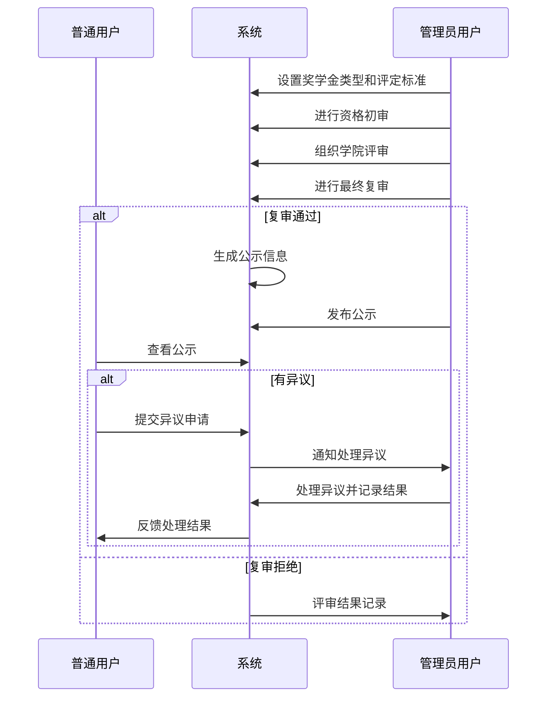
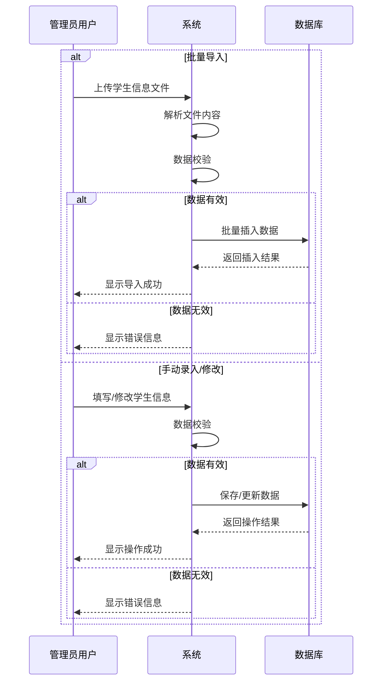
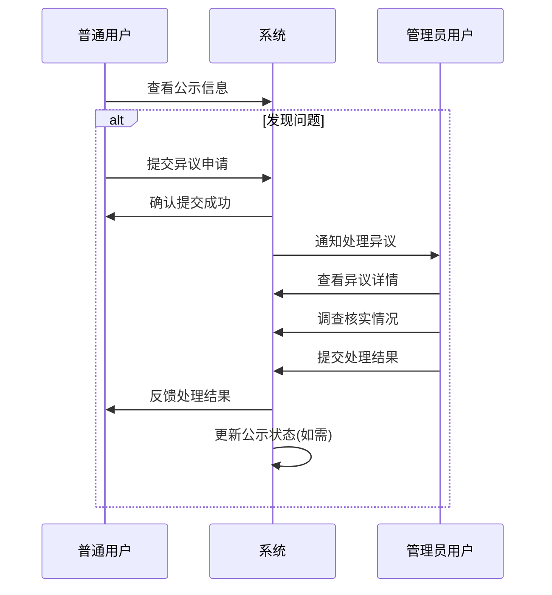

# 高校奖学金管理系统概要设计文档

## 1. 引言

### 1.1 文档目的
本文档为高校奖学金管理系统的概要设计文档，基于前期需求分析，详细描述系统的架构设计、模块划分、数据模型、接口设计等内容，为系统的详细设计和开发提供指导。

### 1.2 术语定义
- **Spring Boot**：基于Spring框架的快速开发框架，简化了Spring应用的配置和部署
- **Thymeleaf**：服务端Java模板引擎，用于Web和独立环境的HTML页面渲染
- **Spring Security**：提供认证、授权和防止常见攻击的安全框架
- **Maven**：Java项目的构建工具和依赖管理工具

## 2. 系统架构设计

### 2.1 整体架构
系统采用经典的三层架构设计，包括表现层、业务逻辑层和数据访问层，同时引入安全层和工具层以增强系统功能。

```
┌─────────────────────────────────────────────────────────────────┐
│                      表现层 (Presentation Layer)                 │
│  ┌─────────────┐  ┌─────────────┐  ┌─────────────────────────┐  │
│  │ Thymeleaf   │  │  控制器     │  │  拦截器/过滤器          │  │
│  │  模板引擎   │  │ Controllers │  │ Interceptors/Filters   │  │
│  └─────────────┘  └─────────────┘  └─────────────────────────┘  │
├─────────────────────────────────────────────────────────────────┤
│                        业务逻辑层 (Service Layer)                 │
│  ┌─────────────┐  ┌─────────────┐  ┌─────────────────────────┐  │
│  │  业务服务   │  │  事务管理   │  │  业务规则验证           │  │
│  │  Services   │  │  Transactions│  │  Validators            │  │
│  └─────────────┘  └─────────────┘  └─────────────────────────┘  │
├─────────────────────────────────────────────────────────────────┤
│                       数据访问层 (DAO Layer)                     │
│  ┌─────────────┐  ┌─────────────┐  ┌─────────────────────────┐  │
│  │  Mapper接口 │  │  实体类     │  │  MyBatis-Plus           │  │
│  │  Mappers    │  │  Entities   │  │                        │  │
│  └─────────────┘  └─────────────┘  └─────────────────────────┘  │
├─────────────────────────────────────────────────────────────────┤
│                           基础设施层                             │
│  ┌─────────────┐  ┌─────────────┐  ┌─────────────────────────┐  │
│  │  数据存储   │  │  安全框架   │  │  工具类                 │  │
│  │  MySQL      │  │Spring Security│ │  Utils                 │  │
│  └─────────────┘  └─────────────┘  └─────────────────────────┘  │
└─────────────────────────────────────────────────────────────────┘
```

### 2.2 技术选型

| 分类 | 技术/框架 | 版本 | 用途 |
|------|-----------|------|------|
| 后端框架 | Spring Boot | 3.2.x | 应用基础框架 |
| 前端技术 | Thymeleaf | 3.1.x | 模板引擎 |
| 前端技术 | Bootstrap | 5.3.x | UI框架 |
| 前端技术 | jQuery | 3.7.x | JavaScript库 |
| 数据库 | MySQL | 8.0+ | 关系型数据库 |
| 安全框架 | Spring Security | 6.2.x | 安全认证和授权 |
| 构建工具 | Maven | 3.9.x | 项目构建和依赖管理 |
| 日志框架 | Logback | 1.5.x | 日志管理 |

## 3. 模块设计

### 3.1 模块划分
系统按功能划分为以下核心模块：

1. **系统基础模块**：提供用户认证、权限管理、系统配置等基础功能
2. **学生信息管理模块**：管理学生基本信息、学业信息和综合表现
3. **奖学金评定管理模块**：处理奖学金类型定义、申请、评审和发放
4. **公示管理模块**：管理评定结果公示和异议处理
5. **工具支持模块**：提供文件上传下载、数据导入导出等通用功能

### 3.2 核心模块设计

#### 3.2.1 系统基础模块

**主要职责**：
- 用户认证和授权
- 角色和权限管理
- 系统参数配置
- 日志记录和审计

**主要组件**：
- `UserController`：处理用户登录、注册和个人信息管理
- `AuthService`：认证和授权服务
- `RoleService`、`PermissionService`：角色和权限管理服务
- `LogService`：操作日志记录服务

#### 3.2.2 学生信息管理模块

**主要职责**：
- 学生基本信息的CRUD操作
- 学生学业信息管理
- 学生综合表现记录
- 数据导入导出和统计分析

**主要组件**：
- `StudentController`：学生信息管理控制器
- `StudentService`：学生信息管理服务
- `AcademicInfoService`：学业信息管理服务
- `PerformanceService`：综合表现管理服务
- `StudentMapper`、`AcademicInfoMapper`、`PerformanceMapper`：数据访问接口

#### 3.2.3 奖学金评定管理模块

**主要职责**：
- 奖学金类型和标准定义
- 多级评审流程管理

**主要组件**：
- `ScholarshipController`：奖学金管理控制器
- `ScholarshipTypeService`：奖学金类型管理服务
- `ReviewService`：评审流程管理服务
- 各类相关Mapper接口

#### 3.2.4 公示管理模块

**主要职责**：
- 评定结果公示发布
- 异议受理和处理

**主要组件**：
- `AnnouncementController`：公示管理控制器
- `AnnouncementService`：公示管理服务
- `ObjectionService`：异议处理服务
- `AnnouncementMapper`、`ObjectionMapper`：数据访问接口

#### 3.2.5 工具支持模块

**主要职责**：
- 文件上传和下载
- 数据导入导出（Excel、CSV）
- 数据校验
- 通用工具类

**主要组件**：
- `FileService`：文件处理服务
- `ImportExportService`：数据导入导出服务
- `ValidationUtils`：数据校验工具
- 各类通用Utils类

## 4. 类设计

### 4.1 核心实体类

#### 4.1.1 用户相关类
```java
@Entity
@Table(name = "sys_user")
@Data
public class User {
    @Id
    @GeneratedValue(strategy = GenerationType.IDENTITY)
    private Long id;            // 用户ID
    private String username;    // 用户名
    private String password;    // 密码（加密存储）
    private String realName;    // 真实姓名
    private String role;        // 角色（normal:普通用户, admin:管理员用户）
    private String email;       // 邮箱
    private String phone;       // 手机号
    private Integer status;     // 状态（0:禁用, 1:启用）
    private Date createTime;    // 创建时间
    private Date updateTime;    // 更新时间
    // 其他字段...
}

@Data
public class Role {
    private Long id;            // 角色ID
    private String roleName;    // 角色名称
    private String roleDesc;    // 角色描述
    // 其他字段...
}

@Data
public class Permission {
    private Long id;            // 权限ID
    private String permName;    // 权限名称
    private String permCode;    // 权限编码
    private String url;         // 资源路径
    // 其他字段...
}
```

#### 4.1.2 学生相关类
```java
@Data
public class Student {
    private String studentId;   // 学号
    private String name;        // 姓名
    private String gender;      // 性别
    private Date birthday;      // 出生日期
    private String college;     // 学院
    private String major;       // 专业
    private String className;   // 班级
    private String email;       // 邮箱
    private String phone;       // 手机号
    private String dormitory;   // 宿舍
    private String politicalStatus;  // 政治面貌
    private Date enrollmentDate;     // 入学日期
    // 其他字段...
}

@Data
public class AcademicInfo {
    private Long id;            // ID
    private String studentId;   // 学号
    private String courseName;  // 课程名称
    private String semester;    // 学期
    private Double score;       // 成绩
    private Double credit;      // 学分
    private String courseType;  // 课程类型
    // 其他字段...
}

@Data
public class Performance {
    private Long id;            // ID
    private String studentId;   // 学号
    private String type;        // 表现类型（奖惩、社会实践等）
    private String title;       // 标题
    private String description; // 描述
    private String level;       // 级别
    private Date date;          // 日期
    private String certificateNumber; // 证书编号
    // 其他字段...
}
```

#### 4.1.3 奖学金相关类
```java
@Data
public class ScholarshipType {
    private Long id;            // 类型ID
    private String name;        // 奖学金名称
    private Double amount;      // 金额
    private Integer quota;      // 名额
    private String criteria;    // 评定标准
    private Integer status;     // 状态
    // 其他字段...
}

@Data
public class Review {
    private Long id;            // 评审ID
    private String studentId;   // 学生ID
    private Long scholarshipTypeId; // 奖学金类型ID
    private Long reviewerId;    // 评审人ID
    private String reviewComments;   // 评审意见
    private Integer reviewResult;    // 评审结果
    private Date reviewTime;    // 评审时间
    private Integer reviewLevel;     // 评审级别（1:初审, 2:学院评审, 3:学校复审）
    // 其他字段...
}
```

#### 4.1.4 公示相关类
```java
@Data
public class Announcement {
    private Long id;            // 公示ID
    private String title;       // 标题
    private String content;     // 内容
    private Date startTime;     // 开始时间
    private Date endTime;       // 结束时间
    private Integer status;     // 状态（0:草稿, 1:公示中, 2:已结束）
    private Long creatorId;     // 创建人ID
    private Date createTime;    // 创建时间
    // 其他字段...
}

@Data
public class Objection {
    private Long id;            // 异议ID
    private Long announcementId;// 公示ID
    private String studentId;   // 提出人学号
    private String content;     // 异议内容
    private Date submitTime;    // 提交时间
    private Integer status;     // 处理状态（0:待处理, 1:处理中, 2:已处理）
    private String handleResult;// 处理结果
    private Long handlerId;     // 处理人ID
    private Date handleTime;    // 处理时间
    // 其他字段...
}
```

## 5. 数据库设计

### 5.1 数据库表结构

#### 5.1.1 用户相关表

**`sys_user`表**
| 字段名 | 数据类型 | 约束 | 描述 |
|--------|----------|------|------|
| `id` | `BIGINT` | `PRIMARY KEY AUTO_INCREMENT` | 用户ID |
| `username` | `VARCHAR(50)` | `UNIQUE NOT NULL` | 用户名 |
| `password` | `VARCHAR(100)` | `NOT NULL` | 密码 |
| `real_name` | `VARCHAR(20)` | `NOT NULL` | 真实姓名 |
| `role` | `VARCHAR(20)` | `NOT NULL` | 角色（normal:普通用户, admin:管理员用户） |
| `email` | `VARCHAR(100)` | | 邮箱 |
| `phone` | `VARCHAR(20)` | | 手机号 |
| `status` | `TINYINT` | `DEFAULT 1` | 状态(0:禁用,1:启用) |
| `create_time` | `DATETIME` | `DEFAULT CURRENT_TIMESTAMP` | 创建时间 |
| `update_time` | `DATETIME` | `DEFAULT CURRENT_TIMESTAMP ON UPDATE CURRENT_TIMESTAMP` | 更新时间 |

**`sys_role`表**
| 字段名 | 数据类型 | 约束 | 描述 |
|--------|----------|------|------|
| `id` | `BIGINT` | `PRIMARY KEY AUTO_INCREMENT` | 角色ID |
| `role_name` | `VARCHAR(50)` | `UNIQUE NOT NULL` | 角色名称 |
| `role_desc` | `VARCHAR(200)` | | 角色描述 |
| `create_time` | `DATETIME` | `DEFAULT CURRENT_TIMESTAMP` | 创建时间 |

**`sys_permission`表**
| 字段名 | 数据类型 | 约束 | 描述 |
|--------|----------|------|------|
| `id` | `BIGINT` | `PRIMARY KEY AUTO_INCREMENT` | 权限ID |
| `perm_name` | `VARCHAR(100)` | `NOT NULL` | 权限名称 |
| `perm_code` | `VARCHAR(100)` | `UNIQUE NOT NULL` | 权限编码 |
| `url` | `VARCHAR(200)` | | 资源路径 |
| `create_time` | `DATETIME` | `DEFAULT CURRENT_TIMESTAMP` | 创建时间 |

**`sys_role_permission`表**
| 字段名 | 数据类型 | 约束 | 描述 |
|--------|----------|------|------|
| `role_id` | `BIGINT` | `PRIMARY KEY` | 角色ID |
| `perm_id` | `BIGINT` | `PRIMARY KEY` | 权限ID |

#### 5.1.2 学生相关表

**`student`表**
| 字段名 | 数据类型 | 约束 | 描述 |
|--------|----------|------|------|
| `student_id` | `VARCHAR(20)` | `PRIMARY KEY` | 学号 |
| `name` | `VARCHAR(20)` | `NOT NULL` | 姓名 |
| `gender` | `VARCHAR(10)` | | 性别 |
| `birthday` | `DATE` | | 出生日期 |
| `college` | `VARCHAR(100)` | `NOT NULL` | 学院 |
| `major` | `VARCHAR(100)` | `NOT NULL` | 专业 |
| `class_name` | `VARCHAR(50)` | | 班级 |
| `email` | `VARCHAR(100)` | | 邮箱 |
| `phone` | `VARCHAR(20)` | | 手机号 |
| `dormitory` | `VARCHAR(50)` | | 宿舍 |
| `political_status` | `VARCHAR(20)` | | 政治面貌 |
| `enrollment_date` | `DATE` | | 入学日期 |
| `create_time` | `DATETIME` | `DEFAULT CURRENT_TIMESTAMP` | 创建时间 |
| `update_time` | `DATETIME` | `DEFAULT CURRENT_TIMESTAMP ON UPDATE CURRENT_TIMESTAMP` | 更新时间 |

**`academic_info`表**
| 字段名 | 数据类型 | 约束 | 描述 |
|--------|----------|------|------|
| `id` | `BIGINT` | `PRIMARY KEY AUTO_INCREMENT` | ID |
| `student_id` | `VARCHAR(20)` | `NOT NULL` | 学号 |
| `course_name` | `VARCHAR(100)` | `NOT NULL` | 课程名称 |
| `semester` | `VARCHAR(20)` | `NOT NULL` | 学期 |
| `score` | `DECIMAL(5,2)` | | 成绩 |
| `credit` | `DECIMAL(3,1)` | | 学分 |
| `course_type` | `VARCHAR(50)` | | 课程类型 |
| `create_time` | `DATETIME` | `DEFAULT CURRENT_TIMESTAMP` | 创建时间 |
| `update_time` | `DATETIME` | `DEFAULT CURRENT_TIMESTAMP ON UPDATE CURRENT_TIMESTAMP` | 更新时间 |

**`performance`表**
| 字段名 | 数据类型 | 约束 | 描述 |
|--------|----------|------|------|
| `id` | `BIGINT` | `PRIMARY KEY AUTO_INCREMENT` | ID |
| `student_id` | `VARCHAR(20)` | `NOT NULL` | 学号 |
| `type` | `VARCHAR(50)` | `NOT NULL` | 表现类型 |
| `title` | `VARCHAR(200)` | `NOT NULL` | 标题 |
| `description` | `TEXT` | | 描述 |
| `level` | `VARCHAR(50)` | | 级别 |
| `date` | `DATE` | | 日期 |
| `certificate_number` | `VARCHAR(100)` | | 证书编号 |
| `create_time` | `DATETIME` | `DEFAULT CURRENT_TIMESTAMP` | 创建时间 |
| `update_time` | `DATETIME` | `DEFAULT CURRENT_TIMESTAMP ON UPDATE CURRENT_TIMESTAMP` | 更新时间 |

#### 5.1.3 奖学金相关表

**`scholarship_type`表**
| 字段名 | 数据类型 | 约束 | 描述 |
|--------|----------|------|------|
| `id` | `BIGINT` | `PRIMARY KEY AUTO_INCREMENT` | 类型ID |
| `name` | `VARCHAR(100)` | `NOT NULL` | 奖学金名称 |
| `amount` | `DECIMAL(10,2)` | `NOT NULL` | 金额 |
| `quota` | `INTEGER` | `NOT NULL` | 名额 |
| `criteria` | `TEXT` | | 评定标准 |
| `status` | `TINYINT` | `DEFAULT 1` | 状态 |
| `create_time` | `DATETIME` | `DEFAULT CURRENT_TIMESTAMP` | 创建时间 |
| `update_time` | `DATETIME` | `DEFAULT CURRENT_TIMESTAMP ON UPDATE CURRENT_TIMESTAMP` | 更新时间 |

**`review`表**
| 字段名 | 数据类型 | 约束 | 描述 |
|--------|----------|------|------|
| `id` | `BIGINT` | `PRIMARY KEY AUTO_INCREMENT` | 评审ID |
| `student_id` | `VARCHAR(20)` | `NOT NULL` | 学号 |
| `scholarship_type_id` | `BIGINT` | `NOT NULL` | 奖学金类型ID |
| `reviewer_id` | `BIGINT` | `NOT NULL` | 评审人ID |
| `review_comments` | `TEXT` | | 评审意见 |
| `review_result` | `TINYINT` | `NOT NULL` | 评审结果 |
| `review_time` | `DATETIME` | `DEFAULT CURRENT_TIMESTAMP` | 评审时间 |
| `review_level` | `TINYINT` | `NOT NULL` | 评审级别 |

#### 5.1.4 公示相关表

**`announcement`表**
| 字段名 | 数据类型 | 约束 | 描述 |
|--------|----------|------|------|
| `id` | `BIGINT` | `PRIMARY KEY AUTO_INCREMENT` | 公示ID |
| `title` | `VARCHAR(200)` | `NOT NULL` | 标题 |
| `content` | `TEXT` | `NOT NULL` | 内容 |
| `start_time` | `DATETIME` | `NOT NULL` | 开始时间 |
| `end_time` | `DATETIME` | `NOT NULL` | 结束时间 |
| `status` | `TINYINT` | `DEFAULT 0` | 状态 |
| `creator_id` | `BIGINT` | `NOT NULL` | 创建人ID |
| `create_time` | `DATETIME` | `DEFAULT CURRENT_TIMESTAMP` | 创建时间 |
| `update_time` | `DATETIME` | `DEFAULT CURRENT_TIMESTAMP ON UPDATE CURRENT_TIMESTAMP` | 更新时间 |

**`objection`表**
| 字段名 | 数据类型 | 约束 | 描述 |
|--------|----------|------|------|
| `id` | `BIGINT` | `PRIMARY KEY AUTO_INCREMENT` | 异议ID |
| `announcement_id` | `BIGINT` | `NOT NULL` | 公示ID |
| `student_id` | `VARCHAR(20)` | `NOT NULL` | 提出人学号 |
| `content` | `TEXT` | `NOT NULL` | 异议内容 |
| `submit_time` | `DATETIME` | `DEFAULT CURRENT_TIMESTAMP` | 提交时间 |
| `status` | `TINYINT` | `DEFAULT 0` | 处理状态 |
| `handle_result` | `TEXT` | | 处理结果 |
| `handler_id` | `BIGINT` | | 处理人ID |
| `handle_time` | `DATETIME` | | 处理时间 |

#### 5.1.5 系统日志表

**`sys_log`表**
| 字段名 | 数据类型 | 约束 | 描述 |
|--------|----------|------|------|
| `id` | `BIGINT` | `PRIMARY KEY AUTO_INCREMENT` | 日志ID |
| `user_id` | `BIGINT` | | 用户ID |
| `username` | `VARCHAR(50)` | | 用户名 |
| `operation` | `VARCHAR(100)` | `NOT NULL` | 操作内容 |
| `method` | `VARCHAR(255)` | | 请求方法 |
| `params` | `TEXT` | | 请求参数 |
| `ip` | `VARCHAR(50)` | | IP地址 |
| `time` | `LONG` | `NOT NULL` | 执行时间(ms) |
| `create_time` | `DATETIME` | `DEFAULT CURRENT_TIMESTAMP` | 创建时间 |

### 5.2 索引设计

| 表名 | 索引名 | 索引字段 | 索引类型 | 说明 |
|------|--------|----------|----------|------|
| `sys_user` | `idx_username` | `username` | UNIQUE | 加速用户登录查询 |
| `student` | `idx_student_id` | `student_id` | PRIMARY KEY | 主键索引 |
| `student` | `idx_college_major` | `college, major` | 复合索引 | 按学院专业查询 |
| `application` | `idx_student_status` | `student_id, status` | 复合索引 | 查询学生申请状态 |
| `application` | `idx_type_status` | `scholarship_type_id, status` | 复合索引 | 查询特定类型申请 |
| `review` | `idx_application_level` | `application_id, review_level` | 复合索引 | 查询申请的评审记录 |
| `announcement` | `idx_status_time` | `status, start_time` | 复合索引 | 查询公示状态和时间 |
| `objection` | `idx_announcement_status` | `announcement_id, status` | 复合索引 | 查询公示的异议处理 |

## 6. 接口设计

### 6.1 系统基础模块接口

#### 6.1.1 用户认证接口
- **登录接口**
  - URL: `/api/auth/login`
  - 方法: POST
  - 请求参数: `{"username": "...", "password": "..."}`
  - 响应: `{"code": 200, "message": "登录成功", "data": {"token": "...", "user": {...}}}`

- **登出接口**
  - URL: `/api/auth/logout`
  - 方法: POST
  - 响应: `{"code": 200, "message": "登出成功"}`

- **获取用户信息接口**
  - URL: `/api/auth/info`
  - 方法: GET
  - 响应: `{"code": 200, "data": {"username": "...", "realName": "...", "role": "...", ...}}`

#### 6.1.2 权限管理接口
- **角色管理接口**
  - 查询角色列表: GET `/api/role/list`
  - 创建角色: POST `/api/role/create`
  - 修改角色: PUT `/api/role/update`
  - 删除角色: DELETE `/api/role/delete/{id}`

- **权限管理接口**
  - 查询权限列表: GET `/api/permission/list`
  - 分配权限: POST `/api/role/assign-permissions`

### 6.2 学生信息管理模块接口

#### 6.2.1 学生基本信息接口
- **查询学生列表**
  - URL: `/api/student/list`
  - 方法: GET
  - 请求参数: `page`, `limit`, `college`, `major`, `studentId`, `name`
  - 响应: 分页学生列表

- **获取学生详情**
  - URL: `/api/student/{studentId}`
  - 方法: GET
  - 响应: 学生详细信息

- **添加/修改学生信息**
  - URL: `/api/student/save`
  - 方法: POST
  - 请求参数: 学生信息JSON对象
  - 响应: 操作结果

- **删除学生信息**
  - URL: `/api/student/delete/{studentId}`
  - 方法: DELETE
  - 响应: 操作结果

- **导入/导出学生信息**
  - 导入: POST `/api/student/import` (文件上传)
  - 导出: GET `/api/student/export` (文件下载)

#### 6.2.2 学生学业信息接口
- **查询学业信息**
  - URL: `/api/academic/list`
  - 方法: GET
  - 请求参数: `studentId`, `semester`
  - 响应: 学业信息列表

- **添加/修改学业信息**
  - URL: `/api/academic/save`
  - 方法: POST
  - 请求参数: 学业信息JSON对象
  - 响应: 操作结果

- **导入/导出成绩**
  - 导入: POST `/api/academic/import` (文件上传)
  - 导出: GET `/api/academic/export` (文件下载)

### 6.3 奖学金评定管理模块接口

#### 6.3.1 奖学金类型管理接口
- **查询奖学金类型列表**
  - URL: `/api/scholarship/type/list`
  - 方法: GET
  - 响应: 奖学金类型列表

- **添加/修改奖学金类型**
  - URL: `/api/scholarship/type/save`
  - 方法: POST
  - 请求参数: 奖学金类型JSON对象
  - 响应: 操作结果

#### 6.3.2 奖学金申请管理接口
- **提交申请**
  - URL: `/api/application/submit`
  - 方法: POST
  - 请求参数: `{"scholarshipTypeId": 1, "reason": "..."}`
  - 响应: 操作结果

- **查询申请列表**
  - URL: `/api/application/list`
  - 方法: GET
  - 请求参数: `page`, `limit`, `status`, `studentId`, `scholarshipTypeId`
  - 响应: 分页申请列表

- **上传申请材料**
  - URL: `/api/application/upload`
  - 方法: POST
  - 请求参数: 文件上传
  - 响应: 文件路径信息

#### 6.3.3 评审管理接口
- **提交评审意见**
  - URL: `/api/review/submit`
  - 方法: POST
  - 请求参数: `{"applicationId": 1, "reviewComments": "...", "reviewResult": 1}`
  - 响应: 操作结果

- **查询评审历史**
  - URL: `/api/review/history/{applicationId}`
  - 方法: GET
  - 响应: 评审历史记录

### 6.4 公示管理模块接口

#### 6.4.1 公示管理接口
- **发布公示**
  - URL: `/api/announcement/publish`
  - 方法: POST
  - 请求参数: 公示信息JSON对象
  - 响应: 操作结果

- **查询公示列表**
  - URL: `/api/announcement/list`
  - 方法: GET
  - 请求参数: `page`, `limit`, `status`
  - 响应: 分页公示列表

- **获取公示详情**
  - URL: `/api/announcement/{id}`
  - 方法: GET
  - 响应: 公示详细信息

#### 6.4.2 异议管理接口
- **提交异议**
  - URL: `/api/objection/submit`
  - 方法: POST
  - 请求参数: `{"announcementId": 1, "content": "..."}`
  - 响应: 操作结果

- **处理异议**
  - URL: `/api/objection/handle`
  - 方法: POST
  - 请求参数: `{"objectionId": 1, "handleResult": "...", "status": 2}`
  - 响应: 操作结果

- **查询异议列表**
  - URL: `/api/objection/list`
  - 方法: GET
  - 请求参数: `page`, `limit`, `announcementId`, `status`
  - 响应: 分页异议列表

## 7. 主业务流程

### 7.1 奖学金评定流程



### 7.2 学生信息管理流程



### 7.3 异议处理流程



## 8. 安全设计

### 8.1 身份认证与授权
- 使用Spring Security进行用户认证和权限管理
- 采用基于角色的访问控制(RBAC)机制
- 密码采用BCrypt加密存储
- 敏感操作需要二次认证

### 8.2 数据安全
- 数据传输使用HTTPS加密
- 敏感数据存储加密
- 定期数据备份和灾难恢复机制
- 防止SQL注入、XSS等常见攻击

### 8.3 日志审计
- 记录关键操作日志，包括操作人、操作时间、操作内容、IP地址等
- 定期对日志进行审查和分析
- 异常操作告警机制

## 9. 部署设计

### 9.1 环境要求

| 环境 | 配置要求 |
|------|----------|
| 操作系统 | Windows Server 2019/2022 或 Linux (CentOS 8/RHEL 8/Ubuntu 20.04+) |
| JDK | JDK 17+ |
| 数据库 | MySQL 8.0+ |
| 应用服务器 | 内嵌Tomcat (Spring Boot) |
| 内存 | 至少4GB RAM |
| 硬盘 | 至少50GB可用空间 |

### 9.2 部署方式
- 打包为可执行JAR文件
- 使用Docker容器化部署
- 支持负载均衡和高可用性部署

### 9.3 配置管理
- 环境变量管理配置信息
- 配置文件外部化
- 多环境配置(开发、测试、生产)

## 10. 测试与验收

### 10.1 测试策略
- 单元测试：测试各个模块的独立功能
- 集成测试：测试模块间的交互
- 系统测试：测试完整的系统功能
- 性能测试：测试系统在高负载下的性能
- 安全测试：测试系统的安全性

### 10.2 验收标准
- 功能验收：所有功能按需求文档实现
- 性能验收：响应时间符合要求，支持规定的并发用户数
- 安全验收：通过安全测试，无重大安全漏洞
- 可用性验收：系统稳定运行，用户操作流畅

## 11. 维护与支持

### 11.1 系统维护
- 定期更新依赖组件
- 定期备份数据
- 监控系统运行状态
- 及时修复bug和安全漏洞

### 11.2 技术支持
- 提供用户操作手册
- 建立问题反馈机制
- 提供技术咨询和培训服务
- 建立系统升级和扩展方案

## 12. 风险评估与应对

### 12.1 潜在风险
- **数据安全风险**：学生敏感信息泄露
- **系统性能风险**：大数据量处理导致性能下降
- **业务变更风险**：奖学金政策变化导致系统调整
- **用户适应性风险**：用户对系统使用不熟悉

### 12.2 应对措施
- 加强数据加密和访问控制
- 优化数据库查询，使用缓存机制
- 采用模块化设计，提高系统灵活性
- 提供详细的用户培训和操作手册
- 建立系统运维和问题处理机制